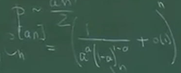
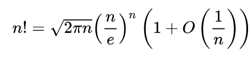

$$C_{n}^{[an]} \sim \frac{n^{[an]}}{[an]!}$$

Формула Стирлинга для факториала:
$$n! = \sqrt{2\pi n} \left(\frac{n}{e}\right)^n \left(1+o\left(\frac{1}{n}\right)\right)$$
$$[an]! \le \sqrt{2\pi\,an} \left(\frac{an}{e}\right)^{an} \left(1+o\left(\frac{1}{an}\right)\right)$$

$$
\frac{n^{[an]}}{[an]!} 
= \frac{n^{[an]}}{\sqrt{2\pi\,[an]} \left(\frac{[an]}{e}\right)^{[an]} \left(1+o\left(\frac{1}{[an]}\right)\right)}
$$

$$
\frac{n^{an}}{(an)^{1/2}(an)^{an}} 
= \frac{1}{n^{\frac{1}{2}} a^{\frac{1}{2}}a^{an}}
= \left( \frac{1}{n^{\frac{1}{2n}} a^{\frac{1}{2n}}a^a} \right)^n
$$