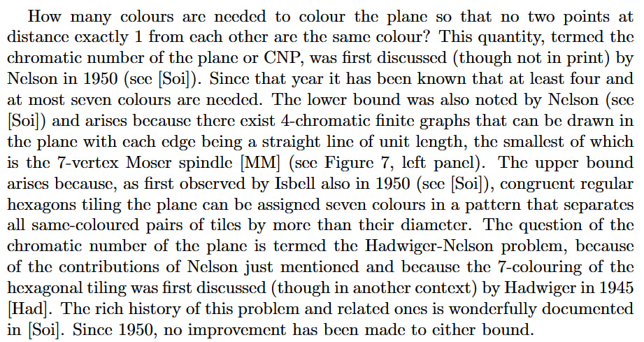

How many *colors* are needed to color the *plane* so that no two *points* at *distance* exactly 1 from each other are the same color?
---
How many colors are required to paint the plane in a such way that any two points separated by distance exactly 1 both have the same color?

This quantity, termed the *chromatic number of the plane or CNP*, was first discussed (though not in print) by Nelson in 1950.
---
In 1950 Nelson introduced the number which was called the chromatic number of the plane or shortly CNP.

Since that year it has been known that at least four and at most seven colors are needed.
---
At the same time the possible interval for this number was given: not less than 4 and not greater than 7.

The *lower bound* was also noted by *Nelson* and arises because there exist *4-chromatic finite graphs* that can be drawn in the plane with each *edge* being a straight line of unit length, the smallest of which is the *7-vertex Moser spindle* (see Figure 7, left panel).
---
Nelson determined the lower bound by constructing a 4-chromatic finite graph with the following property: every edge of the graph connects two points in the plane only if the line between these points has a length equal to one. The smallest known graph with this property is the 7-vertex Moser spindle (look at Figure 7, on left panel).

The upper bound arises because, as first observed by Isbell also in 1950, *congruent regular hexagons* tiling the plane can be assigned seven colors in a pattern that separates all *same-colored* pairs of tiles by more than their diameter.
---
Also in 1950 Isbell found a color pattern that demonstrates the upper bound by considering congruent regular hexagons covering the plane: seven colors is enough to separate all same-colored areas by a distance more than 1.

The question of the chromatic number of the plane is termed the Hadwiger-Nelson problem, because of the contributions of Nelson just mentioned and because the 7-coloring of the hexagonal tiling was first discussed (though in another context) by Hadwiger in 1945.

The rich history of this problem and related ones is wonderfully documented in [Soi].

Since 1950, no improvement has been made to either bound.
