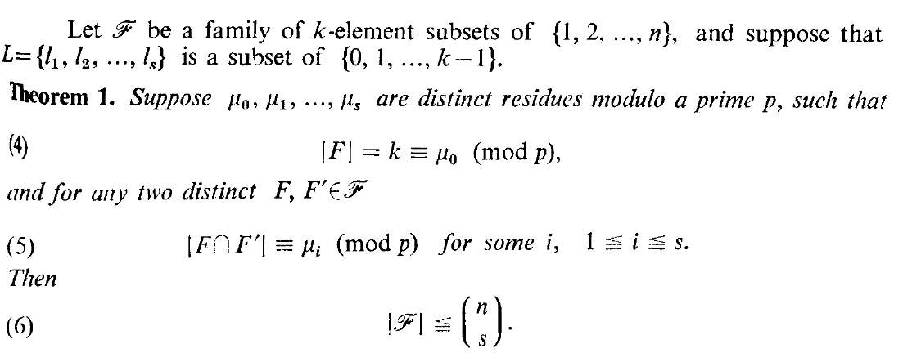
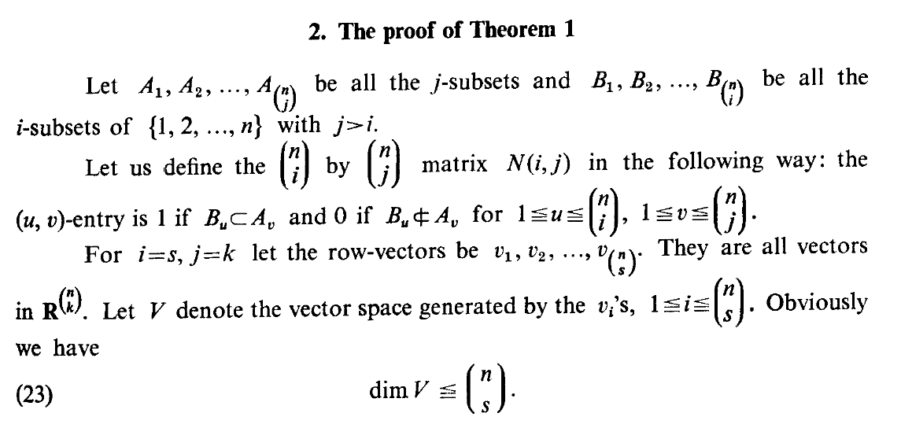
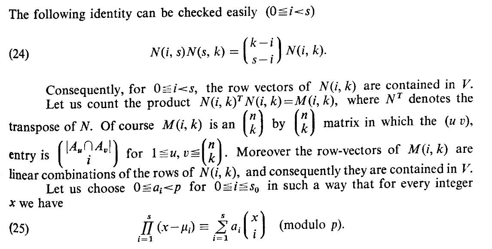
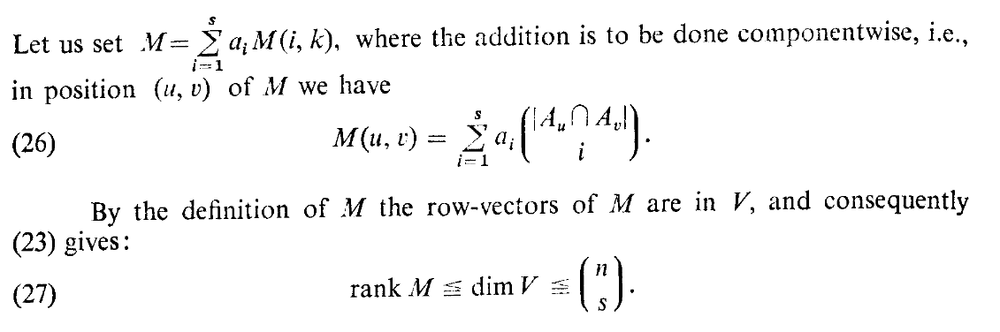
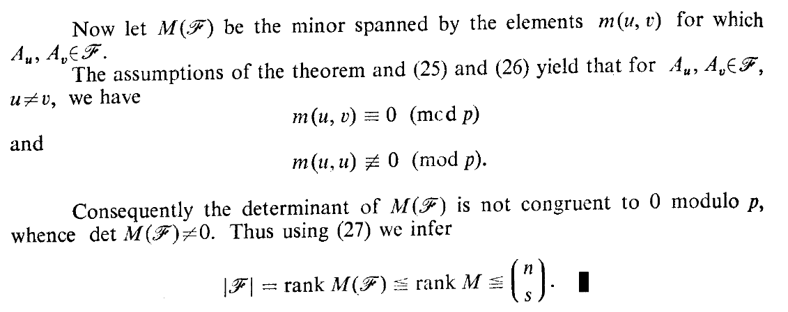

# Теорема Франкл-Вилсон (1981)

P. Frankl, R. Wilson Intersection theorems with geometric consequences, 1981

## Определение

Let be а family of $k$-element subsets of $\{1,2, ..., n\}$, and suppose that $L=\{l_1, l_1, ..., l_s\}$ is а subset of $\{0,1, ..., k-1\}$.

**Theorem 1.** Suppose $\mu_0, \mu_1, ..., \mu_s$ are distinct residucs modulo а primc $р$, such that
$$
\begin{equation}
|F| = k \equiv \mu_0 \pmod{p},
\end{equation}
$$
апс for ану two distinct $F, F' \in \mathscr{F}$
$$|F \cap F'| \equiv \mu_i \pmod{р},\quad for\: some\:i,\quad 1\le i \le s.$$ 
(5)
Тћеп
(6) F'l (modp)

## Доказательство

