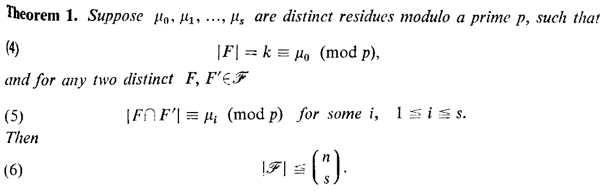

# Теорема Франкла-Вилсона (1981)

P. Frankl, R. Wilson Intersection theorems with geometric consequences, 1981

## Введение

Пусть есть множество чисел $\{1,2,...,10\}$. Пусть множество $\mathscr{F}$ содержит все 4-х элементные подмножества множества $V$, такие что любые два элемента из $W$ не должны пересекаться по 1 или 3 элементам. То есть разрешенные пересечения $L=\{0,2\}$, $s=2$. Тогда $\mathscr{F} \le C_n^s = \frac{n(n-1)}{2}$

## Теорема 1

**Theorem 1.** Пусть $\mathscr{F}$ - совокупность $k$-элементных подмножеств множества $\{1,2, ..., n\}$, и пусть $L=\{l_1, l_1, ..., l_s\}$ - подмножество множества $\{0,1, ..., k-1\}$. Пусть $\mu_0, \mu_1, ..., \mu_s$ - различные целы остатки по модулю простого числа $р$, такие что
$$|F| = k \equiv \mu_0 \pmod{p},\tag{4}$$
для любых двух различных множеств $F, F' \in \mathscr{F}$
$$|F \cap F'| \equiv \mu_i \pmod{р},\quad for\: some\:i,\quad 1\le i \le s. \tag{5}$$ 
(5)
Тогда
$$\mathscr{|F|} \le C_{n}^{s}$$

## Доказательство теоремы 1

