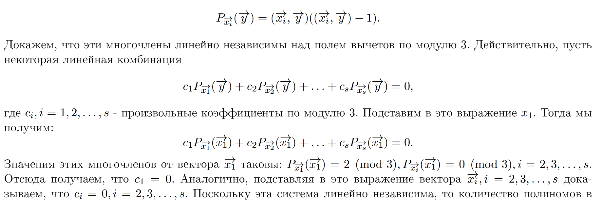

Я все-таки чего-то не понимаю, поэтому спрошу. На рисунке показано доказательство из семинара (неделя 4 задача 3). Насколько я понимаю, система многочленов линейно независимая, если линейная комбинация многочленов будет равна нулевого многочлену только с нулевыми коэффициентами $c_i$, $i=1,...,s$. В приведенном доказательстве мы проверяем не это. Проверяется, что значения многочленов будут линейно независимы (не многочлены, а их значения в каких-то точках).

Почему из линейной независимости значений многочленов в некоторых точках следует линейная независимость многочленов?

Например: 
$$P_{x_1}(y) = y_1^2 + y_2^2 + y_1\,y_2 + y_1 + y_2$$
$$P_{x_2}(y) = y_2^2 + y_3^2 + y_2\,y_3 + y_2 + y_3$$