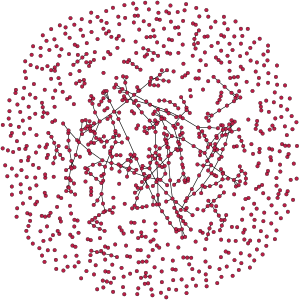

# Erdős–Rényi random graph model and its applications in technology

## Intro

In the **mathematical** field of graph theory, the *Erdős–Rényi model* refers to one of two closely related models for generating random graphs or the evolution of a random network. These models are named after Hungarian mathematicians Paul Erdős and Alfréd Rényi, who introduced one of the models in 1959.

## Definition

In the $G(n, p)$ model, a graph is constructed by connecting labeled nodes randomly. Each edge is included in the graph with probability $p$, independently from every other edge. Equivalently, the probability for generating each graph that has $n$ nodes and $M$ edges is $p^M(1 − p )^{\binom{n}{2} − M}$. The parameter $p$ in this model can be thought of as a weighting function; as $p$ increases from 0 to 1 , the model becomes more and more likely to include graphs with more edges and less and less likely to include graphs with fewer edges. In particular, the case $p=\frac{1}{2}$ corresponds to the case where all $2^\binom{n}{2}$ graphs on $n$ vertices are chosen with equal probability.

The behavior of random graphs are often studied in the case where $n$, the number of vertices, tends to infinity. In this case $p$ can be a function depending on n. For example, the statement that almost every graph in $G(n, \frac{2ln(n)}{n})$ is connected means that, as $n$ tends to infinity, the probability that a graph on $n$ vertices with edge probability $\frac{2ln(n)}{n}$ is connected tends to $1$.

